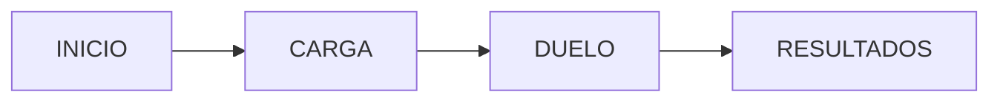

````markdown
# TECH02 -- Arquitectura Mínima (Versión Técnico‑Funcional Intermedia)

## 1. Objetivo

Definir la mínima arquitectura necesaria para entregar un MVP funcional
que permita validar el flujo de votación entre jugadores sin introducir
complejidad innecesaria.

## 2. Pantallas

- **Inicio**: Carga los jugadores y explica el funcionamiento.
- **Duelo**: Presenta 1 vs 1 y permite votar.
- **Resultados**: Muestra orden final según victorias/derrotas.

## 3. Estado global

Zustand se usa porque: - Es simple como un useState global. - Evita
re-renderizados masivos del Context. - Escala bien si más adelante hay
más modos o datos.

Variables clave: - `queue` - `current` - `next` - `eliminated`

## 4. Flujo

1.  Inicio prepara los datos.\
2.  Duelo muestra current vs next.\
3.  Usuario vota → se registra ganador/perdedor.\
4.  Se avanza la cola.\
5.  Si la cola termina → se muestran los resultados.

## 5. Diagrama (Mermaid)



## 6. Razonamiento arquitectónico

- Se elige **Arquitectura A** porque el dominio aún es muy pequeño.
- Si crece el número de pantallas, modos o estadísticas → migrar a
  modular.
- Next.js proporciona estructura mínima sin sobrecarga.

## 7. Beneficios

- Implementación rápida.
- Fácil de refactorizar.
- Legible incluso para equipos pequeños o MVP.
````
